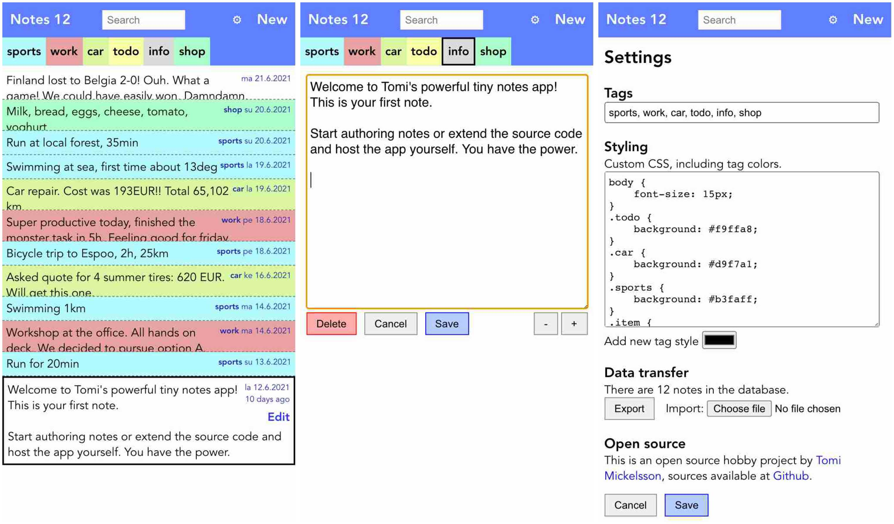

Tiny Notes
==========

The app is hosted at [tinynotes.tomicloud.com](https://tinynotes.tomicloud.com).

Tiny notes is a mobile notes app that provides the essential note taking or
diary features in a small package. The user interface is minimal but
functional.

Technically tiny notes is an PWA web app that works offline. No data is stored
at or communicated to the server.

The source code is small in size. If you know the basics of web development,
it is easy to extend the app with extra features.

**Screenshots: main view, edit view, settings**




Core features
-------------

Tiny notes packs together these features that I have found essential in a
notes app:

- fast and simple user interface (any annoyances would cause daily pain)
- notes are color coded based on tag
- notes can be quickly searched via tag or text
- note creation date is adjustable (to set correct date later)
- export and import of data (single json file)
- look'n'feel can be customized (injected CSS)

Since I myself am the primary customer for this app, it lacks other features
and also requires some technical skills to customize the CSS style. To make it
better for YOU, grab the sources and hack!


Tech stack
----------

Tiny notes is created with [Vue](https://vuejs.org/)
front-end framework and [Vite](https://vitejs.dev/) tooling with a single [PWA
plugin](https://github.com/antfu/vite-plugin-pwa). Instant joy!

Local database of notes is implemented via standard browser IndexedDB.

There are only 3 main source files with under 700 lines of code:

```
├─ /src/
│  ├── App.vue # UI template, CSS and logic to handle actions (Vue SFC)
│  ├── db.js   # api to indexeddb
│  └── util.js # utility functions
```

The app contains logic to refresh itself automatically when the files at the
host server are updated, provided by the PWA plugin.

Netlify is used for hosting the static files, with continuous deployment.

Developing
----------

To run and develop the app locally, download the sources and invoke:

    npm install
    ./run.sh

and then open your browser at [localhost:3000](http://localhost:3000).

To distribute the app invoke:

    ./build.sh

and the output files appear in dist/. Copy these files to your host and then
serve them via https to activate PWA functionality.

If you serve the app from a sub folder, remember to configure the base folder
in vite.config.js.


Motivation
----------

I am an active note taker, jotting down things and thoughts to remember every
day. During the years I've used many notes apps that don't have the correct
features in place or come with too bloated user interfaces.

The most recent notes app that I used on my Android was a quite decent [OmniPlus](https://play.google.com/store/apps/details?id=it.feio.android.omninotes), partly because it is [open source](https://github.com/federicoiosue/Omni-Notes).

I had the intention to modify its sources to suit me better but yikes - it is
a big codebase! There is a total of 170 java files with 21967 lines of
code, not counting tests! Too serious for me, never had the energy to get
started.

Back in 2009 I coded an Android notes app myself that participated in the
Google Android Developer Challenge 2. The app GooMemo is [still available at
the play store](https://play.google.com/store/apps/details?id=com.pocketspark.goomemo&hl=en&gl=US) but I didn't have the time to maintain it after some years. (It's spirit maybe lives here in Tiny notes.)

Being familiar with webtech, I have known that it does not take a great effort
to build a mobile notes app as a PWA. It doesn't need to have the bells and
whistles, just a very focused, minimal and fast UI. Web is perfectly fine for
that. Since I like side projects, I implemented this app for myself and
released the sources for anybody to tinker with.

I finally have a notes app that suits me best, with a tiny codebase that can
be instantly modified to add new features.


License
-------
MIT License


Author
-------
App is coded by [Tomi Mickelsson](https://tomicloud.com).

